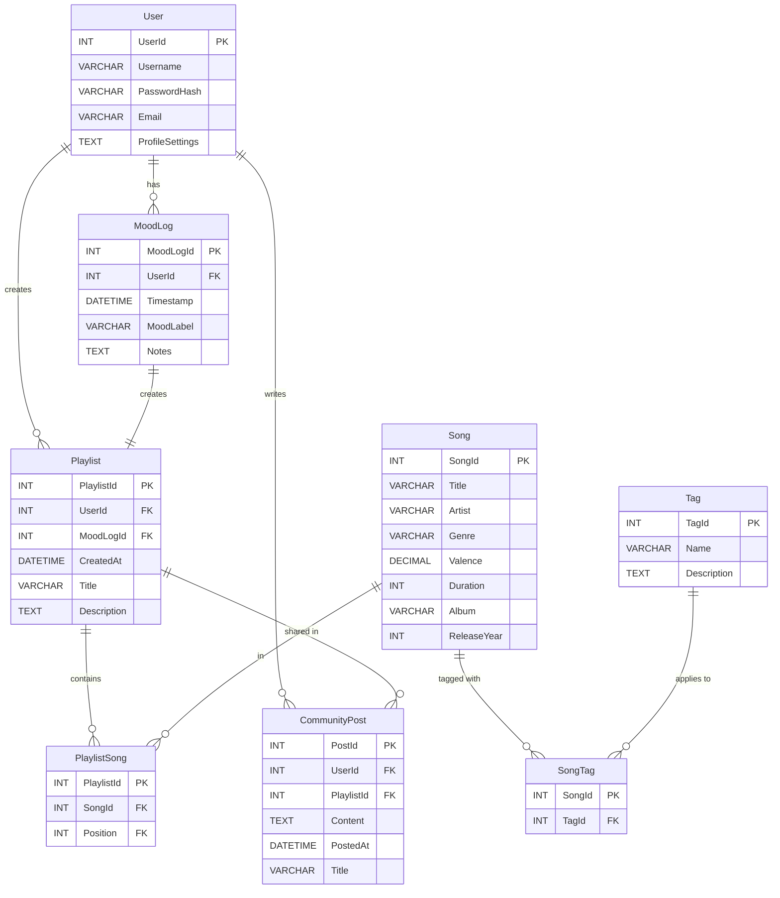

# Database Design

## Diagram Overview



The ERD represents the [MeloMood](./Project Description.md) music recommendation system centered around its users and their moods. Each **User**:

* Has an account with preferences.
* Logs their moods over time through **MoodLogs** (timestamped entries labeled with a mood).
* Each mood entry generates one **Playlist**, which contains a curated list of **Songs**.
* **Playlists** can be optionally shared via **CommunityPost**, allowing user interaction.
* **Songs** are stored with metadata and linked to playlists through **PlaylistSong**.
* **Tags** are applied to songs via the **SongTag** join table for categorization.

## Entities and Assumptions

### User

**Assumptions**:

* Represents each individual using MeloMood.
* Requires login credentials and personal settings.

**Entity vs Attribute**:

* Modeled as an entity because it owns personalized data (MoodLogs, Playlists, CommunityPosts).

```sql
User(
  UserId: INT [PK],
  Username: VARCHAR(255),
  PasswordHash: VARCHAR(255),
  Email: VARCHAR(255),
  ProfileSettings: TEXT
)
```

### MoodLog

**Assumptions**:

* Logs a user’s mood at a point in time.
* Drives playlist generation and mood analytics.

**Entity vs Attribute**:

* Represents a frequent, independent user action.

```sql
MoodLog(
  MoodLogId: INT [PK],
  UserId: INT [FK to User.UserId],
  Timestamp: DATETIME,
  MoodLabel: VARCHAR(64),
  Notes: TEXT
)
```

### Playlist

**Assumptions**:

* Created from a specific MoodLog.
* Contains songs curated for that mood.

**Entity vs Attribute**:

* Complex structure, associated with many songs, and sharable.

```sql
Playlist(
  PlaylistId: INT [PK],
  UserId: INT [FK to User.UserId],
  MoodLogId: INT [FK to MoodLog.MoodLogId],
  CreatedAt: DATETIME,
  Title: VARCHAR(255),
  Description: TEXT
)
```

### Song

**Assumptions**:

* Master song list with metadata.
* Can appear in multiple playlists and have multiple tags.

**Entity vs Attribute**:

* Central, reusable object with many relationships.

```sql
Song(
  SongId: INT [PK],
  Title: VARCHAR(255),
  Artist: VARCHAR(255),
  Genre: VARCHAR(64),
  Valence: DECIMAL(3,2),
  Duration: INT,
  Album: VARCHAR(255),
  ReleaseYear: INT
)
```

### PlaylistSong

**Assumptions**:

* Join table to resolve the many-to-many Playlist-Song relationship.
* Stores the order of songs.

**Entity vs Attribute**:

* Required entity to store `Position`.

```sql
PlaylistSong(
  PlaylistId: INT [FK to Playlist.PlaylistId],
  SongId: INT [FK to Song.SongId],
  Position: INT,
  [PK: PlaylistId, Position]
)
```

### Tag

**Assumptions**:

* Reusable mood/genre/attribute labels.

**Entity vs Attribute**:

* Independently managed and reused across songs.

```sql
Tag(
  TagId: INT [PK],
  Name: VARCHAR(64),
  Description: TEXT
)
```

### CommunityPost

**Assumptions**:

* Represents posts shared with the community, optionally linked to a playlist.

**Entity vs Attribute**:

* Modeled for scalability (e.g., support for comments, post types).

```sql
CommunityPost(
  PostId: INT [PK],
  UserId: INT [FK to User.UserId],
  PlaylistId: INT [FK to Playlist.PlaylistId],
  Content: TEXT,
  PostedAt: DATETIME,
  Title: VARCHAR(255)
)
```

### SongTag

**Assumptions**:

* Resolves the many-to-many relationship between Songs and Tags.

**Entity vs Attribute**:

* Required join entity.

```sql
SongTag(
  SongId: INT [FK to Song.SongId],
  TagId: INT [FK to Tag.TagId],
  [PK: SongId, TagId]
)
```

## Relationships

| Relationship             | Type         | Cardinality                 | Assumptions                                                  |
| ------------------------ | ------------ | --------------------------- | ------------------------------------------------------------ |
| **User → MoodLog**       | One-to-Many  | 1 User → Many MoodLogs      | MoodLog has FK to User. Each entry is time-stamped.          |
| **User → Playlist**      | One-to-Many  | 1 User → Many Playlists     | Playlist has FK to User.                                     |
| **MoodLog → Playlist**   | One-to-One   | 1 MoodLog → 1 Playlist      | Playlist has FK to MoodLog. Strict 1:1 mapping.              |
| **Playlist ↔ Song**      | Many-to-Many | Many Playlists ↔ Many Songs | Resolved by PlaylistSong with song order.                    |
| **Tag ↔ Song**           | Many-to-Many | Many Tags ↔ Many Songs      | Resolved by SongTag. Tags can describe mood, genre, etc.     |
| **User → CommunityPost** | One-to-Many  | 1 User → Many Posts         | CommunityPost references User. Playlist sharing is optional. |

## Normalization & Functional Dependencies

| Entity            | Primary Key (PK)       | Functional Dependencies                                                       | Normal Form |
| ----------------- | ---------------------- | ----------------------------------------------------------------------------- | ----------- |
| **User**          | UserId                 | UserId → Username, PasswordHash, Email, ProfileSettings                       | BCNF        |
| **MoodLog**       | MoodLogId              | MoodLogId → UserId, Timestamp, MoodLabel, Notes                               | BCNF        |
| **Playlist**      | PlaylistId             | PlaylistId → MoodLogId, CreatedAt, Title, Description<br> MoodLogId → UserId  | 3NF         |
| **Song**          | SongId                 | SongId → Title, Artist, Genre, Valence, Duration, Album, ReleaseYear          | BCNF        |
| **PlaylistSong**  | (PlaylistId, Position) | (PlaylistId, Position) → SongId <br> UNIQUE (PlaylistId, SongId)              | BCNF        |
| **Tag**           | TagId                  | TagId → Name, Description                                                     | BCNF        |
| **SongTag**       | (SongId, TagId)        | No non-key attributes: → ∅                                                    | BCNF        |
| **CommunityPost** | PostId                 | PostId → UserId, PlaylistId, Content, PostedAt, Title<br> PlaylistId → UserId | 3NF         |

### Notes

* **PK** = Primary Key (unique identifier)
* **AltKey** = Alternate key enforced with a `UNIQUE` constraint
* **Functional dependencies** use the format: `determinant → dependents`
