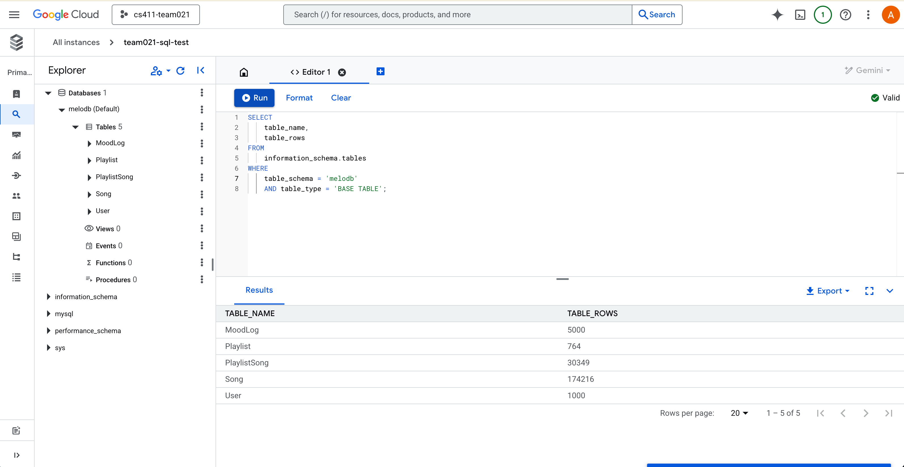
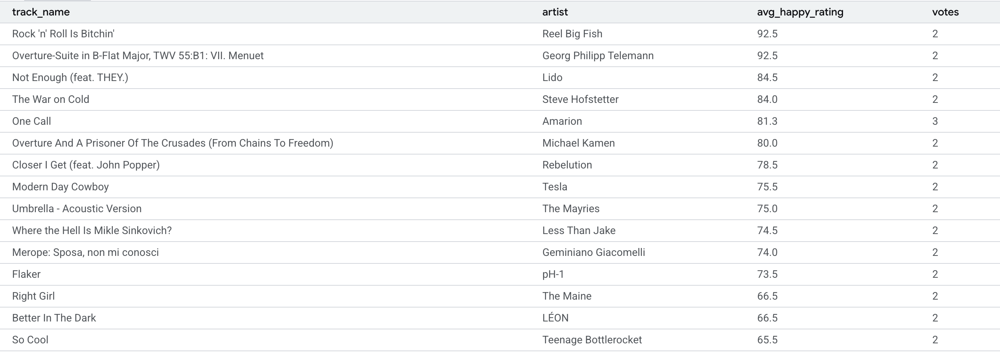
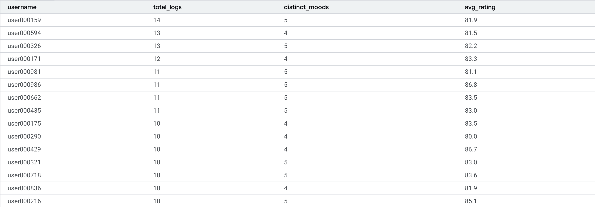
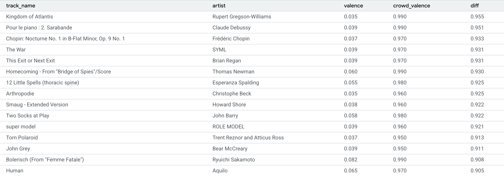
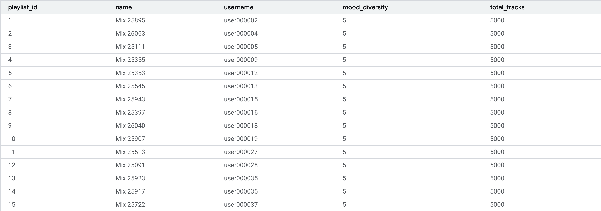

# Database Implementation and Indexing

## Part 1

### 1) Implement at least five tables


### 2) Provide DDL
Please reference the [database design](Database%20Design.md#Entities%20and%20Assumptions) from previous submission.

### 3) Insert data into these tables
In the screenshot above, it also highlights row count in each table.
It should satisfy the 1000-row requirement.

### 4) Advanced SQL queries
All following advanced SQL queries are provided with a screenshot of the top 15 rows of each query result, unless specified explicitly.

#### Top happy tracks in last 30 days
```sql
SELECT
    s.track_name, s.artist,
    ROUND(AVG(m.rating),1) AS avg_happy_rating,
    COUNT(*) AS votes
FROM
    Song s
    JOIN MoodLog m ON m.song_id = s.song_id
WHERE
    m.mood_label = 'Happy'
    AND m.ts >= NOW() - INTERVAL 30 DAY
GROUP BY
    s.song_id
HAVING
    votes >= 2
ORDER BY
    avg_happy_rating DESC
LIMIT
    15;
```



#### Find active users
Selects the users who have logged >= 3 moods with average ratings >= 80.

```sql
SELECT
    u.username,
    COUNT(*) AS total_logs,
    COUNT(DISTINCT m.mood_label) AS distinct_moods,
    ROUND(AVG(m.rating),1) AS avg_rating
FROM
    User u
    JOIN MoodLog m USING (user_id)
GROUP BY
    u.user_id
HAVING
    distinct_moods >= 3
    AND avg_rating >= 80
ORDER BY
    total_logs DESC
LIMIT
    15;
```



#### Valence differences
```sql
WITH crowd AS (
    SELECT
        song_id,
        AVG(CASE WHEN mood_label='Happy' THEN rating END)/100 AS crowd_valence
    FROM
        MoodLog
    GROUP BY
        song_id
    )
SELECT
    s.track_name,
    s.artist,
    s.valence,
    ROUND(c.crowd_valence,3) AS crowd_valence,
    ROUND(ABS(s.valence-c.crowd_valence),3) AS diff
FROM
    Song s
    JOIN crowd c USING (song_id)
WHERE
    c.crowd_valence IS NOT NULL
HAVING
    diff > 0.30
ORDER BY
    diff DESC
LIMIT
    15;
```



#### Find playlists with diversed mood
Finds the top 15 playlists by mood diversity and size, and shows moods represented and total number of logs considered for analysis.

```sql
SELECT
    p.playlist_id,
    p.name,
    u.username,
    COUNT(DISTINCT m.mood_label) AS mood_diversity,
    COUNT(*) AS total_tracks
FROM
    Playlist p
    JOIN User u USING (user_id)
    JOIN PlaylistSong ps USING (playlist_id)
    JOIN MoodLog m ON m.song_id = ps.song_id
GROUP BY
    p.playlist_id
ORDER BY
    mood_diversity DESC,
    total_tracks DESC
LIMIT
    15;
```



## Part 2

### 1) `EXPLAIN ANALYZE`

#### Top happy tracks in last 30 days
| Step                                   | Input Rows | Output Rows | Cost   | Purpose/Operation                        |
|-----------------------------------------|------------|-------------|--------|------------------------------------------|
| Table scan on MoodLog (m)               | 5,000      | 5,000       | 437    | Reads every MoodLog row                  |
| Filter: mood_label='Happy' and recent   | 5,000      | 340         | 437    | Keeps only 'Happy' in last 30 days       |
| PK join: Song using song_id             | 340        | 340         | 0.25   | Gets song data for each filtered log     |
| Group/Aggregate by song_id              | 340        | 40          | —      | Aggregates ratings/counts per song       |
| Filter: votes >= 2                      | 40         | 40          | —      | Keeps only songs with at least 2 votes   |
| Sort: avg_happy_rating DESC             | 40         | 40          | —      | Sorts songs by average happy rating desc |

#### Find active users
| Step                                        | Input Rows | Output Rows | Cost   | Purpose/Operation                                        |
|----------------------------------------------|------------|-------------|--------|----------------------------------------------------------|
| Index scan on User (u) using PRIMARY         | 1,000      | 1,000       | 101    | Reads all User rows                                      |
| Index lookup on MoodLog (m) using idx_moodlog_user_ts (user_id=u.user_id) | 1,000 | 5,000 | 0.705  | Finds MoodLogs for each user                             |
| Nested loop inner join                       | 1,000      | 5,000       | 1087   | Joins each User to their MoodLogs                        |
| Group aggregate: avg(m.rating), count(*), count(distinct m.mood_label) | 5,000 | 617 | 1369   | Groups MoodLogs by user, computes aggregates              |
| Stream results                               | 617        | 617         | 1369   | Streams grouped results                                  |
| Filter: (distinct_moods >= 3 AND avg_rating >= 80) | 617  | 246     | —      | Keeps users with at least 3 moods and avg_rating >= 80   |
| Sort: total_logs DESC                        | 246        | 246         | —      | Sorts final users by total_logs (descending)             |

#### Valence differences
| Step                                                | Input Rows | Output Rows | Cost   | Purpose/Operation                                                    |
|-----------------------------------------------------|------------|-------------|--------|---------------------------------------------------------------------|
| Index scan on MoodLog using idx_moodlog_song_mood   | 5,000      | 5,000       | 504    | Reads all MoodLog rows using index                                  |
| Group aggregate: avg(CASE WHEN mood_label='Happy')  | 5,000      | 40          | 1004   | Aggregates to compute crowd_valence per song                        |
| Filter: avg(CASE ...) IS NOT NULL                   | 40         | 40          | 1004   | Keeps only songs with non-null average crowd_valence                |
| Materialize CTE crowd                               | 40         | 40          | 1423   | Stores CTE results (crowd) in memory                                |
| Table scan on c                                     | 40         | 40          | 1423   | Reads all rows from CTE                                             |
| Filter: (c.song_id IS NOT NULL)                     | 40         | 40          | 1423   | Ensures valid song_id in CTE                                        |
| Nested loop inner join (Song JOIN crowd)            | 40         | 40          | 2315   | Joins Song to crowd using song_id                                   |
| Stream results                                      | 40         | 40          | 2315   | Streams the joined results                                          |
| Filter: diff > 0.30                                 | 40         | 21          | —      | Keeps only rows where |valence - crowd_valence| > 0.30             |
| Sort: diff DESC                                     | 21         | 21          | —      | Sorts final songs by difference descending                          |

#### Find playlists with diversed mood
| Step                                                | Input Rows | Output Rows | Cost    | Purpose/Operation                                                   |
|-----------------------------------------------------|------------|-------------|---------|---------------------------------------------------------------------|
| Index scan on Playlist (p) using PRIMARY            | 764        | 764         | 77.4    | Reads all Playlists                                                 |
| Single-row index lookup on User (u) using PRIMARY   | 764        | 764         | 0.25    | Finds User for each Playlist                                        |
| Covering index lookup on PlaylistSong (ps) using PK | 764        | 30,560      | 0.274   | Gets all songs for each Playlist                                    |
| Covering index lookup on MoodLog (m) using idx_moodlog_song_mood | 30,560   | 3,820,000   | 0.25    | Finds MoodLogs for each song in PlaylistSong                        |
| Nested loop inner join (x3, see above)              | Various    | 3,820,000   | 14,830  | Joins Playlists, Users, Songs, and MoodLogs                         |
| Group aggregate: count(distinct m.mood_label), count(*) | 3,820,000 | 764     | 18,458  | Aggregates mood diversity and total tracks per Playlist              |
| Stream results                                      | 764        | 764         | 18,458  | Streams grouped Playlist results                                    |
| Sort: mood_diversity DESC, total_tracks DESC        | 764        | 764         | —       | Sorts Playlists by mood diversity and track count descending        |

### 2) Explore tradeoffs of adding different indices

#### Top happy tracks in last 30 days

* **mood_label**
  ```sql
  CREATE INDEX idx_ml_moodlabel ON MoodLog(mood_label);
  ```
* **(mood_label, ts)**
  ```sql
  CREATE INDEX idx_ml_mood_ts ON MoodLog(mood_label, ts);
  ```
* **(mood_label, ts, song_id)**
  ```sql
  CREATE INDEX idx_ml_mood_ts_songid ON MoodLog(mood_label, ts, song_id);
  ```

| Step                                | Default Cost | MoodLabel Cost | (mood_label, ts) Cost | (mood_label, ts, song_id) Cost |
|--------------------------------------|--------------|---------------|-----------------------|-------------------------------|
| Table scan on MoodLog (m)           | 437          | —             | —                     | —                             |
| Index lookup on mood_label           | —            | 45.5          | —                     | —                             |
| Index range scan on mood_label, ts   | —            | —             | 153                   | 153                           |
| Nested loop inner join               | 554          | 163           | 272                   | 272                           |
| Rows after filter (m.*)              | 340          | 340           | 340                   | 340                           |
| Single-row PK lookup on Song         | 0.25         | 0.25          | 0.25                  | 0.25                          |
| Rows after aggregation (GROUP BY)    | 40           | 40            | 40                    | 40                            |
| Sort final result                    | 40           | 40            | 40                    | 40                            |

#### Find active users

* **user_id**
  ```sql
  CREATE INDEX idx_ml_userid ON MoodLog(user_id);
  ```
* **(user_id, mood_label)**
  ```sql
  CREATE INDEX idx_ml_userid_moodlabel ON MoodLog(user_id, mood_label);
  ```
* **(user_id, mood_label, rating)**
  ```sql
  CREATE INDEX idx_ml_userid_moodlabel_rating ON MoodLog(user_id, mood_label, rating);
  ```

| Step                                  | Default Cost      | user_id Cost | (user_id, mood_label) Cost | (user_id, mood_label, rating) Cost |
|----------------------------------------------|--------------|--------------|---------------------|----------------------------|
| Stream results                           | 1369         | 2254         | 2254                | 2627                       |
| Nested loop join                         | 1087         | 2254         | 2254                | 1817                       |
| Index lookup/scan on MoodLog             | 0.705        | 504          | 504                 | 0.906 (covering)           |
| Group aggregate                          | 1369         | —            | —                   | 2627                       |


#### Valence differences

* **song_id**
  ```sql
  CREATE INDEX idx_ml_songid ON MoodLog(song_id);
  ```
* **(song_id, mood_label)**
  ```sql
  CREATE INDEX idx_ml_songid_moodlabel ON MoodLog(song_id, mood_label);
  ```
* **(song_id, mood_label, rating)**
  ```sql
  CREATE INDEX idx_ml_songid_moodlabel_rating ON MoodLog(song_id, mood_label, rating);
  ```

| Step                                    | Default | song_id Only Cost | (song_id, mood_label) Cost | (song_id, mood_label, rating) Cost |
|-------------------------------------------------|---------|--------------|---------------------|----------------------------|
| Stream results cost                             | 2315    | 2315         | 2315                | 2315                       |
| Nested loop inner join cost                     | 2315    | 2315         | 2315                | 2315                       |
| Filter (c.song_id is not null) / Table scan on c| 1423    | 1008         | 1008                | 1008                       |
| Materialize CTE crowd                           | 1423    | 1008         | 1008                | 1008                       |
| Filter/Group aggregate (within crowd CTE)       | 1004    | 1004         | 1004                | 1004                       |
| Index scan/covering index scan on MoodLog       | 504     | 504          | 504                 | 504                        |

#### Find playlists with diversed mood

* **song_id**
  ```sql
  CREATE INDEX idx_ml_songid ON MoodLog(song_id);
   ```
* **(song_id, mood_label)**
  ```sql
  CREATE INDEX idx_ml_songid_moodlabel ON MoodLog(song_id, mood_label);
  ```
* **(song_id, mood_label, user_id)**
  ```sql
  CREATE INDEX idx_ml_songid_moodlabel_userid ON MoodLog(song_id, mood_label, user_id);
  ```

| Step / Index                                      | Default  | song_id Only | song_id, mood_label | song_id, mood_label, user_id |
|---------------------------------------------------|----------|--------------|---------------------|------------------------------|
| Stream results cost                               | 18458    | 773526       | 773526              | 773526                       |
| Group aggregate: count(distinct m.mood_label) cost| 18458    | 773526       | 773526              | 773526                       |
| Nested loop inner join (largest join) cost        | 14830    | 393168       | 393168              | 393168                       |
| Next nested loop inner join cost                  | 3593     | 3593         | 3593                | 3593                         |
| Next nested loop inner join cost                  | 345      | 345          | 345                 | 345                          |
| Filter: (p.user_id is not null) cost              | 77.4     | 77.4         | 77.4                | 77.4                         |
| Index scan on Playlist (p) using PRIMARY          | 77.4     | 77.4         | 77.4                | 77.4                         |
| Single-row index lookup on User (u) using PRIMARY | 0.25     | 0.25         | 0.25                | 0.25                         |
| Covering index lookup on PlaylistSong (ps)        | 0.274    | 0.274        | 0.274               | 0.274                        |
| Covering index lookup on MoodLog (m)              | 0.25     | 0.303        | 0.303               | 0.303                        |

### 3) Final index design

### 4)